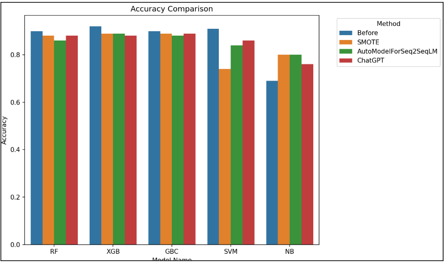
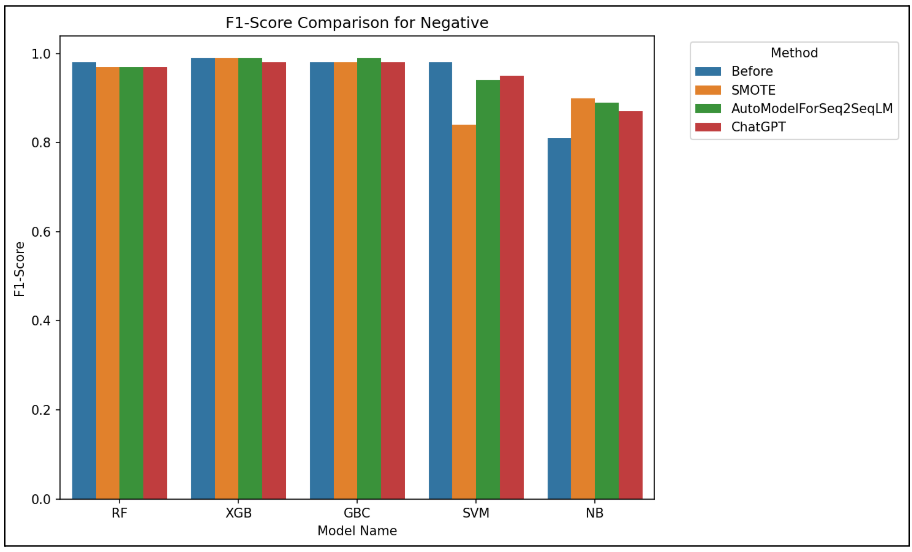
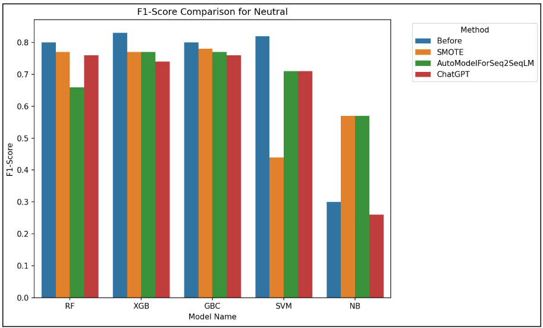
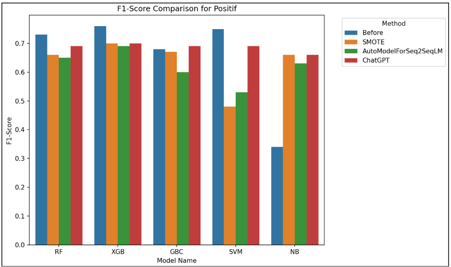

# Textual-Dataset-Oversampling-Using-Paraphrase-Generation_RSBP

# Latar Belakang Masalah

Pada zaman ketika data menjadi bahan baku industri, data memainkan peran yang sangat penting. Akan tetapi, terdapat permasalahan yang tidak bisa dihindari, yaitu data imbalance atau ketidakseimbangan data khususnya pada sebuah dataset textual. Ketidakseimbangan data terjadi ketika jumlah sebuah kelas akan lebih banyak daripada jumlah data yang lainnya, yang sering menyebabkan model bias terhadap kelas mayoritas, sehingga mengurangi akurasi pada kelas minoritas. Salah satu solusi untuk mengatasi masalah ini adalah oversampling. Terdapat banyak metode oversampling yang mencakup teknik seperti SMOTE, augmentasi data, dll. Dalam konteks dataset textual, paraphrase generation menjadi metode augmentasi yang cukup efektif dikarenakan mampu menciptakan variasi data tanpa kehilangan konteks asli. Penelitian ini berfokus pada penggunaan paraphrase generation untuk menangani data imbalance pada dataset tekstual, yang relevan dalam mengembangkan model machine learning yang lebih akurat. Tujuan utamanya adalah meningkatkan performa model klasifikasi teks melalui pendekatan ini, sehingga menghasilkan solusi yang lebih baik untuk tantangan data imbalance.

# Solusi/Metode yang diusulkan/Keterbaruan

Penggunaan paraphrase generation untuk oversampling dataset textual menjadi solusi yang kami gunakan dalam mengatasi data imbalance dengan menciptakan variasi kalimat baru pada kelas minoritas tanpa mengubah makna aslinya, sehingga meningkatkan kualitas dan keseimbangan data.

# Penjelasan Konsep

Pada penelitian ini, digunakan berbagai metode dan teknik yang dirancang untuk meningkatkan kualitas data dalam menangani imbalance data. Penjelasan berikut akan menguraikan definisi, manfaat, dan implementasi dari setiap komponen tersebut untuk memberikan pemahaman yang lebih mendalam tentang relevansinya dalam penelitian ini.

## SMOTE (Synthetic Minority Oversampling Technique)

SMOTE adalah metode oversampling yang bertujuan untuk menangani ketidakseimbangan data dalam klasifikasi dengan cara menghasilkan data sintetik untuk kelas minoritas. Metode ini bekerja dengan memilih sampel dari kelas minoritas, kemudian membuat data baru melalui interpolasi linier antara sampel tersebut dan tetangganya. SMOTE secara efektif meningkatkan sensitivitas model terhadap kelas minoritas tanpa sekadar menduplikasi data asli.

**Manfaat:**
- Meningkatkan performa model pada dataset yang tidak seimbang.
- Meminimalkan bias terhadap kelas mayoritas.
- Menghindari risiko overfitting yang sering terjadi dengan metode penggandaan data.

## Paraphrase Generation

Paraphrase generation adalah proses menghasilkan kalimat yang memiliki makna sama atau serupa tetapi menggunakan struktur atau kata-kata yang berbeda. Teknik ini sering digunakan untuk memperkaya dataset tekstual agar lebih variatif dan membantu model pembelajaran mesin menangani berbagai bentuk input teks.

**Manfaat:**
- Menambah jumlah data pelatihan tanpa kehilangan konteks asli.
- Memperbaiki kemampuan generalisasi model pada data yang belum pernah dilihat sebelumnya.

## Oversampling

Oversampling adalah strategi untuk menangani dataset yang tidak seimbang dengan meningkatkan jumlah sampel pada kelas minoritas. Strategi ini mencakup teknik sederhana seperti duplikasi data hingga metode yang lebih kompleks seperti SMOTE.

**Manfaat:**
- Membantu model memahami pola pada kelas minoritas.
- Meningkatkan nilai metrik evaluasi seperti F1 score pada data yang tidak seimbang.

## ChatGPT

ChatGPT adalah model bahasa besar berbasis transformer yang dapat menghasilkan teks, termasuk parafrase untuk dataset tekstual. Dalam konteks oversampling, ChatGPT dapat digunakan untuk membuat variasi kalimat yang alami dan relevan secara kontekstual, memperkaya data pelatihan secara efektif.

# Model yang digunakan

Beberapa model pembelajaran mesin yang dapat digunakan dalam eksperimen meliputi:
- Random Forest: Algoritma ensemble berbasis pohon keputusan yang menggunakan bootstrap aggregation untuk meningkatkan akurasi dan mengurangi overfitting.
- XGBoost (Extreme Gradient Boosting): Algoritma boosting berbasis pohon yang efisien dan populer untuk data besar.
- Gradient Boosting Classifier: Teknik boosting yang mengoptimalkan loss function dengan menggabungkan beberapa model sederhana.
- Support Vector Machine (SVM): Model berbasis margin yang bekerja dengan mencari hyperplane optimal untuk memisahkan kelas.
- Naive Bayes Model: Algoritma berbasis probabilitas yang sering digunakan untuk klasifikasi teks.

# Eksperimen and Hasil

Dataset yang kami gunakan dalam penelitian ini adalah dataset yang kami kutip dari kaggle dengan nama dataset yaitu “Twitter US Airline Sentiment”. Dataset ini berisikan 14640 data dan terdiri dari 3 sentiments yaitu sentimen positif, negatif, dan neutral. Dari ketiga sentimen ini adapun komposisi dari masing masing dataset tersebut dari negative, netral dan positif berturut turut adalah 9178, 3099, dan 2363.

Terdapat beberapa eksperimen yang kami gunakan untuk menguji metode yang kami usulkan. Kami akan menggunakan beberapa model seperti, Random Forest, XGBoost, Gradient Boosting Classifier, Support vector machine, Naive Bayes model. Kami akan menggunakan seluruh data pada pengujian sebelum dilakukannya oversampling, akan tetapi kami akan menggunakan hanya 1000 sampel data dari total 14640, dengan perbandingan data sebagai berikut:
- Data Negatif = 631 data [63,1%]
- Data Positif = 158 data [15,8%]
- Data Netral = 209 data [20,9%]

## Eksperimen yang kami lakukan antara lain:

### Perhitungan akurasi Seluruh data sebelum dilakukan oversampling [Tabel F1]

| Model Name | Negative | Neutral | Positif | Accuracy | Macro Avg | Weighted Avg |
|------------|----------|---------|---------|----------|-----------|--------------|
| RF         | 0.98     | 0.80    | 0.73    | 0.90     | 0.84      | 0.90         |
| XGB        | 0.99     | 0.83    | 0.76    | 0.92     | 0.86      | 0.92         |
| GBC        | 0.98     | 0.80    | 0.68    | 0.90     | 0.83      | 0.89         |
| SVM        | 0.98     | 0.82    | 0.75    | 0.91     | 0.85      | 0.91         |
| NB         | 0.81     | 0.30    | 0.34    | 0.69     | 0.48      | 0.62         |

### Perhitungan akurasi 1000 data setelah dilakukan oversampling menggunakan SMOTE [Tabel F1]

| Model Name | Negative | Neutral | Positif | Accuracy | Macro Avg | Weighted Avg |
|------------|----------|---------|---------|----------|-----------|--------------|
| RF         | 0.97     | 0.77    | 0.66    | 0.88     | 0.80      | 0.87         |
| XGB        | 0.99     | 0.77    | 0.70    | 0.89     | 0.82      | 0.89         |
| GBC        | 0.98     | 0.78    | 0.67    | 0.89     | 0.81      | 0.89         |
| SVM        | 0.84     | 0.44    | 0.48    | 0.74     | 0.59      | 0.69         |
| NB         | 0.90     | 0.57    | 0.66    | 0.80     | 0.71      | 0.79         |

### Perhitungan akurasi 1000 data setelah dilakukan oversampling menggunakan AutoModelForSeq2SeqLM [Tabel F1]

| Model Name | Negative | Neutral | Positif | Accuracy | Macro Avg | Weighted Avg |
|------------|----------|---------|---------|----------|-----------|--------------|
| RF         | 0.97     | 0.66    | 0.65    | 0.86     | 0.76      | 0.85         |
| XGB        | 0.99     | 0.77    | 0.69    | 0.89     | 0.82      | 0.82         |
| GBC        | 0.99     | 0.77    | 0.60    | 0.88     | 0.78      | 0.87         |
| SVM        | 0.94     | 0.71    | 0.53    | 0.84     | 0.73      | 0.82         |
| NB         | 0.89     | 0.57    | 0.63    | 0.80     | 0.70      | 0.78         |

### Perhitungan akurasi 1000 data setelah dilakukan oversampling menggunakan ChatGPT [Tabel F1]

| Model Name | Negative | Neutral | Positif | Accuracy | Macro Avg | Weighted Avg |
|------------|----------|---------|---------|----------|-----------|--------------|
| RF         | 0.97     | 0.76    | 0.69    | 0.88     | 0.81      | 0.88         |
| XGB        | 0.98     | 0.74    | 0.70    | 0.88     | 0.81      | 0.88         |
| GBC        | 0.98     | 0.76    | 0.69    | 0.89     | 0.81      | 0.89         |
| SVM        | 0.95     | 0.71    | 0.69    | 0.86     | 0.78      | 0.85         |
| NB         | 0.87     | 0.26    | 0.66    | 0.76     | 0.60      | 0.70         |

## Data Comparison 

### Accuracy 

### Negative

### Neutral

### Positive

# Kesimpulan

Ketidakseimbangan data pada dataset textual sering menjadi kendala dalam pengembangan model machine learning, terutama karena model cenderung lebih akurat pada kelas mayoritas dan mengabaikan kelas minoritas. Dalam penelitian ini, kami mencoba mengatasi masalah tersebut dengan pendekatan paraphrase generation. Metode ini memungkinkan kita menciptakan variasi data baru untuk kelas minoritas tanpa mengubah makna aslinya. Dengan cara ini, dataset menjadi lebih seimbang dan relevan, memberikan kesempatan yang adil bagi semua kelas untuk dilatih oleh model secara optimal.

Hasil eksperimen menunjukkan bahwa metode paraphrase generation cukup efektif dalam menangani ketidakseimbangan data pada dataset tekstual. Dengan membandingkan performa model sebelum dan sesudah oversampling menggunakan algoritma seperti Random Forest, XGBoost, Naive Bayes, dan SVM, kami menemukan bahwa SVM memberikan hasil terbaik sesuai dengan harapan awal. Dibandingkan dengan metode tradisional seperti SMOTE, paraphrase generation yang diterapkan bersama SVM menunjukkan peningkatan akurasi, terutama pada kelas minoritas. Hal ini mengindikasikan bahwa pendekatan ini tidak hanya mampu menciptakan dataset yang lebih seimbang, tetapi juga meningkatkan kemampuan model machine learning untuk menghasilkan prediksi yang lebih akurat dan adil, sesuai dengan tujuan penelitian.

# Link penting yang digunakan pada uji coba/eksperimen

- [Link 1](https://chatgpt.com/share/674307a6-c66c-8009-99db-05b46afb24c8)
- [Link 2](https://chatgpt.com/share/6728499e-61cc-8013-92e9-881c61182bd4)
- [Dataset 1](https://gist.githubusercontent.com/jjchoNC/16c564fc4f7f10876e187791377ae56a/raw/90af451b44a1884af7db0bf56c4c1cb949c7ed02/Tweet.csv)
- [Dataset 2](https://gist.githubusercontent.com/jjchoNC/adc51af12c2536325b425e3a7d09e8c4/raw/4015676bd07fff97326e3db56dccd6855e960af5/neutral_gpt.csv)
- [Dataset 3](https://gist.githubusercontent.com/Haalloobim/ea9d5c9d2971803d848d78253df21374/raw/574fd93c1ec372eb12366e6ac05d96bbaa5d0e52/positive_para_df.csv)
- [Kaggle Dataset](https://www.kaggle.com/datasets/crowdflower/twitter-airline-sentiment)
- [Kaggle Code](https://www.kaggle.com/code/jillanisofttech/twitter-us-airline-sentiment-eda/data)
